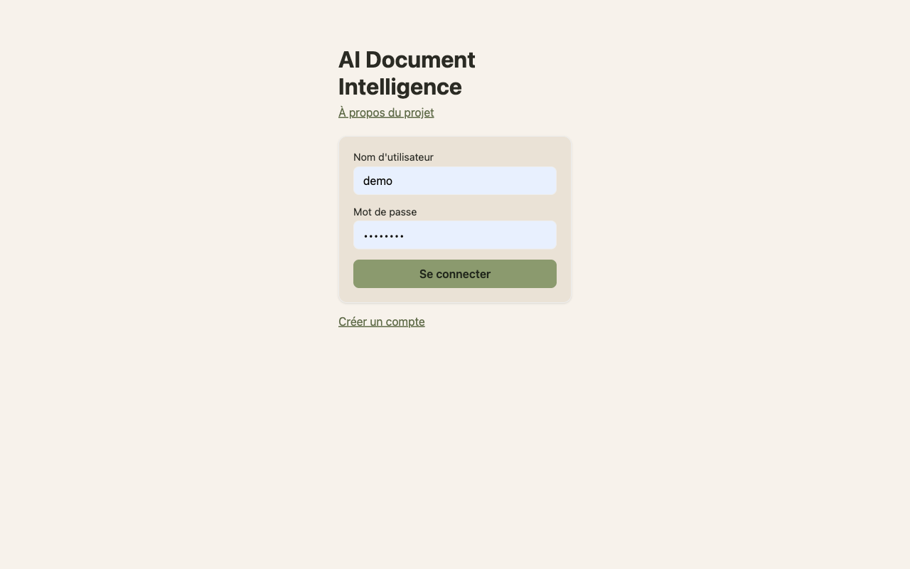

# AI Document Intelligence & RAG Agent — Moroccan Invoices

Système qui lit des factures marocaines (PDF ou scan), en extrait les champs
structurés (ICE, IF, RC, montants, TVA...), permet de poser des questions en
langage naturel sur les documents (RAG), et répond à des questions chiffrées
via un agent qui interroge une vraie base de données au lieu de deviner.

Objectif du projet : constituer une pièce de portfolio pour candidater à des
postes AI Engineer au Maroc, en démontrant OCR, extraction structurée, RAG,
agents avec tool calling, évaluation rigoureuse, et mise en production
(Docker, CI/CD, monitoring).



---

## 1. Pourquoi ce projet

Les entreprises marocaines reçoivent des factures papier ou scannées en
grand nombre. La saisie manuelle dans un ERP est lente, sujette à erreurs
(montants, TVA, dates), et retrouver une information dans l'archive prend du
temps. Ce projet transforme des documents non structurés en données
interrogeables :

- upload d'une facture → champs extraits automatiquement dans PostgreSQL
- question libre ("quelle est la date d'échéance de la facture X ?") → RAG
  avec citation de la source
- question chiffrée ("total des factures impayées en janvier ?") → agent qui
  choisit l'outil SQL, pas le LLM qui invente un nombre

Le principe directeur du projet : **un LLM ne doit jamais calculer un
montant lui-même**. Il route la question vers l'outil déterministe
approprié (SQL, calculatrice) et se contente de formuler la réponse.

---

## 2. Architecture

### 2.1 Vue d'ensemble

```
                     ┌─────────────────────────────────────────┐
                     │                UPLOAD                    │
                     │        PDF ou image de facture            │
                     └───────────────────┬───────────────────────┘
                                          ▼
                     ┌─────────────────────────────────────────┐
                     │                  OCR                      │
                     │   Tesseract / PaddleOCR (fr + ar)          │
                     └───────────────────┬───────────────────────┘
                                          ▼
                     ┌─────────────────────────────────────────┐
                     │             CLASSIFICATION                │
                     │   facture / contrat / rapport              │
                     └───────────────────┬───────────────────────┘
                                          ▼
                     ┌─────────────────────────────────────────┐
                     │               EXTRACTION                  │
                     │   champs → JSON structuré                 │
                     └──────────┬─────────────────┬───────────────┘
                                ▼                 ▼
                     ┌───────────────────┐ ┌───────────────────┐
                     │    PostgreSQL      │ │    Vector DB       │
                     │  champs structurés │ │  chunks + pages     │
                     └───────────────────┘ └───────────────────┘

                     ┌─────────────────────────────────────────┐
                     │            QUESTION UTILISATEUR            │
                     └───────────────────┬───────────────────────┘
                                          ▼
                     ┌─────────────────────────────────────────┐
                     │              AGENT (LLM)                   │
                     │        choisit l'outil approprié            │
                     └──────┬────────────┬────────────┬────────────┘
                            ▼            ▼            ▼
                    ┌──────────────┐┌──────────┐┌──────────────┐
                    │ Recherche doc ││   SQL    ││ Calculatrice  │
                    │ RAG + page    ││ lecture  ││   arithmétique │
                    │   source      ││  seule   ││    exacte      │
                    └──────┬───────┘└────┬─────┘└──────┬───────┘
                           └─────────────┼─────────────┘
                                         ▼
                     ┌─────────────────────────────────────────┐
                     │        RÉPONSE + sources + chiffres        │
                     └─────────────────────────────────────────┘
```

### 2.2 Stack technique

| Couche | Choix | Remarque |
|---|---|---|
| API | FastAPI | REST, auth JWT simple |
| OCR | Tesseract (baseline) puis PaddleOCR | comparer les deux, mesurer le CER |
| Extraction | LLM (prompt structuré → JSON) + regex de secours pour ICE/IF/RC/TVA | ne pas tout confier au LLM |
| Classification | TF-IDF + LogisticRegression **et** LLM zero-shot **et** Jev (TypeSafe System One) | comparer, garder le meilleur rapport coût/précision |
| RAG | embeddings multilingues (type BGE-M3 / multilingual-e5) + BM25 hybride + reranker | chunking par section, pas par nombre de caractères fixe |
| Vector DB | pgvector (dans PostgreSQL) | Chroma/Qdrant envisagés initialement, jamais implémentés — pgvector suffit à l'échelle de ce projet |
| Base relationnelle | PostgreSQL | champs extraits + statut de paiement |
| Agent | function calling (outils : search_documents, query_sql, calculate) | SQL toujours en lecture seule |
| Observabilité | Langfuse ou équivalent open source | coût, latence, traces |
| Évaluation | jeu de test annoté à la main + RAGAS | seule mesure fiable de qualité |
| Conteneurisation | Docker + docker-compose | |
| CI/CD | GitHub Actions | tests automatiques + build image |
| Frontend | React (minimal : upload, chat, tableau de bord) | pas la priorité |

### 2.2bis Environnements Python

Deux environnements virtuels coexistent, pour une raison purement technique :

- **`.venv`** (Python 3.14) — environnement principal du projet (Tesseract,
  extraction, RAG, agent, API...).
- **`.venv-paddle`** (Python 3.12) — dédié à PaddleOCR. `paddlepaddle` n'a pas
  de wheel pour Python 3.14, et sur ce Mac (macOS x86_64), `paddlepaddle==3.0`
  (backend d'inférence PIR) plante à l'exécution. La combinaison qui fonctionne
  est figée dans l'extra `paddleocr` de `pyproject.toml` :
  `paddlepaddle==2.6.2` + `paddleocr==2.7.3` + `numpy<2` +
  `opencv-python-headless==4.9.0.80` + `scipy==1.11.4` + `scikit-image==0.22.0`
  (les versions récentes de scipy/scikit-image exigent numpy≥2, incompatible
  avec paddlepaddle 2.6.2).

```bash
python3.12 -m venv .venv-paddle
.venv-paddle/bin/pip install -e ".[paddleocr]"
.venv-paddle/bin/python -m src.ocr.evaluate --engine paddleocr --lang fr --out docs/eval
```

### 2.3 Principes de sécurité (à ne pas sauter)

- Le contenu d'un document uploadé est une **entrée non fiable** : un texte
  caché dans un PDF pourrait dire "ignore les instructions précédentes".
  Le contenu du document ne doit jamais être interprété comme une
  instruction système.
- L'outil SQL de l'agent n'a que des droits `SELECT` sur des vues limitées,
  jamais d'accès en écriture ni au schéma complet.
- Isolation des données par utilisateur/entreprise (`tenant_id` sur chaque
  table).
- Aucune clé API ni mot de passe par défaut dans le dépôt ; fichier
  `.env.example` uniquement.

---

## 3. Modèle de données (PostgreSQL)

```sql
CREATE TABLE suppliers (
    id            SERIAL PRIMARY KEY,
    tenant_id     UUID NOT NULL,
    name          TEXT NOT NULL,
    ice           TEXT,
    if_number     TEXT,
    rc            TEXT,
    city          TEXT
);

CREATE TABLE documents (
    id              SERIAL PRIMARY KEY,
    tenant_id       UUID NOT NULL,
    file_path       TEXT NOT NULL,
    doc_type        TEXT CHECK (doc_type IN ('invoice','contract','report')),
    uploaded_at     TIMESTAMPTZ DEFAULT now(),
    ocr_confidence  NUMERIC
);

CREATE TABLE invoices (
    id               SERIAL PRIMARY KEY,
    document_id      INTEGER REFERENCES documents(id),
    supplier_id      INTEGER REFERENCES suppliers(id),
    invoice_number   TEXT,
    invoice_date     DATE,
    due_date         DATE,
    total_ht         NUMERIC,
    tva_rate         NUMERIC,
    total_tva        NUMERIC,
    total_ttc        NUMERIC,
    currency         TEXT DEFAULT 'MAD',
    payment_status   TEXT CHECK (payment_status IN ('paid','unpaid'))
);

CREATE TABLE invoice_lines (
    id               SERIAL PRIMARY KEY,
    invoice_id       INTEGER REFERENCES invoices(id),
    description      TEXT,
    quantity         NUMERIC,
    unit_price_ht    NUMERIC,
    total_ht         NUMERIC
);

CREATE TABLE document_chunks (
    id               SERIAL PRIMARY KEY,
    document_id      INTEGER REFERENCES documents(id),
    page_number      INTEGER,
    content          TEXT,
    embedding        VECTOR(1024)  -- si pgvector ; sinon stocké dans Qdrant/Chroma
);
```

Ce schéma correspond aux labels JSON déjà produits par le générateur de
factures synthétiques (`generate_invoices.py`), ce qui permet de calculer
directement les métriques d'extraction (comparaison valeur prédite vs valeur
du label).

---

## 4. Plan de construction, étape par étape

Chaque étape produit quelque chose de démontrable. Ne pas passer à l'étape
suivante avant que l'étape courante ait ses métriques écrites dans
`docs/eval/`.

### Étape 0 — Données (déjà fait)
- [x] Générateur de factures synthétiques marocaines (`generate_invoices.py`)
- [x] 200 factures : PDF propre + image scannée + JSON de vérité terrain
- [x] Split dev/test par fournisseur (pas de fuite de mise en page)
- [ ] Ajouter 50-100 documents publics (FATURA, ReceiptSense) pour tester la
      robustesse hors distribution — vérifier chaque licence avant usage
- [ ] Ajouter quelques documents réels anonymisés si disponibles

### Étape 1 — OCR baseline
- [x] Tesseract sur les 200 images (`--lang fra`) — arabe hors scope pour le
      moment
- [x] Calculer le CER (character error rate) contre le texte de référence
- [x] Tester PaddleOCR sur le même jeu, comparer
- [x] Livrable : tableau CER par profil de scan (clean/scan/bad) et par outil
      → `docs/eval/2026-09-22-ocr-comparison.md`

### Étape 2 — Extraction de champs
- [x] Prompt LLM structuré : texte OCR → JSON (schéma fixe : numéro, date,
      fournisseur, ICE, montants...)
- [x] Extraction de secours par regex pour les champs à format fixe (ICE 15
      chiffres, dates, montants)
- [x] Comparer champ par champ avec le label (exact match + F1)
- [x] Livrable : precision/recall par champ, dans un tableau README
      → `docs/eval/2026-09-22-extraction-baseline.md`

| Champ | Regex F1 | LLM F1 | Combiné F1 |
|---|---|---|---|
| invoice_number | 0.29 | 0.95 | 0.94 |
| invoice_date | 0.81 | 0.97 | 0.98 |
| due_date | 0.99 | 1.00 | 1.00 |
| supplier_name | 0.00 | 0.91 | 0.91 |
| supplier_ice | 0.84 | 0.88 | 0.87 |
| supplier_if | 0.77 | 0.88 | 0.88 |
| supplier_rc | 0.89 | 0.94 | 0.95 |
| total_ht | 0.59 | 0.95 | 0.95 |
| tva_rate | 0.95 | 0.95 | 0.95 |
| total_tva | 0.63 | 0.95 | 0.95 |
| total_ttc | 0.51 | 0.95 | 0.94 |

Mesuré sur les 68 factures du split `test` (jamais utilisées pour ajuster le
code), à partir de la sortie OCR Tesseract (bruitée, pas du texte propre).
Le LLM (Gemini) domine largement le regex seul (`supplier_name` : le regex ne
l'essaie même pas). Le combiné (LLM + regex en filet de secours, uniquement
quand le LLM ne trouve rien) n'apporte qu'un gain marginal — attendu, vu que
le LLM est déjà très bon sur ce jeu de données propre en structure.

### Étape 3 — Classification de documents
- [x] Baseline TF-IDF + LogisticRegression
- [x] LLM zero-shot puis few-shot (+ Jev/TypeSafe System One zero-shot et few-shot)
- [x] Comparer précision, latence, coût par document
- [x] Garder la méthode la plus adaptée
      → `docs/eval/2026-09-22-classification-baseline.md` — **Jev retenu**
      (choix produit, voir justification ci-dessous)

⚠️ Aucun contrat/rapport réel n'existait dans le projet (`data/public/` et
`data/real_anonymized/` vides, Étape 0 non complétée). Débloqué avec
`generate_docs.py` : 60 contrats + 60 rapports synthétiques en texte brut
(pas de rendu PDF/scan). **Les 5 méthodes obtiennent 100% d'accuracy** sur ce
jeu — le vocabulaire des 3 classes synthétiques est trop disjoint pour être
un test discriminant réel ; voir la limite méthodologique détaillée dans le
rapport. Un vrai test attend les documents publics/réels de l'Étape 0.

**Pourquoi Jev plutôt que TF-IDF malgré un score identique ici** : sur ce
jeu synthétique (vocabulaire trivialement disjoint entre classes), TF-IDF
gagne sur le coût/la latence, mais c'est un modèle bag-of-words qui risque
de moins bien généraliser à de vrais documents (vocabulaire administratif
qui se recoupe davantage entre facture/contrat/rapport dans la réalité).
Jev reste peu coûteux et rapide (~$0.0001/doc de cet ordre de grandeur côté
LLM comparable, latence 0.3s) tout en étant un modèle de décision entraîné
plus robuste hors distribution. À reconfirmer avec de vraies données
(Étape 0) avant de trancher définitivement.

### Étape 4 — Stockage
- [x] Schéma PostgreSQL (section 3) + migrations (Alembic)
      → `docker-compose.yml` (pgvector/pgvector:pg16), `db/models.py`,
      `db/migrations/` — appliqué et vérifié (6 tables, CHECK constraints,
      `embedding vector(1024)`)
- [x] Script d'ingestion : image → OCR → extraction → insertion DB
      → `db/ingest.py` — 200/200 factures ingérées (9 en repli regex seul,
      LLM indisponible ponctuellement)
- [x] Chunking des documents par section + indexation vectorielle
      → `src/rag/chunking.py` + `src/rag/embeddings.py` + `db/index_chunks.py`
      — **85/200 documents indexés (995 chunks)**, le reste bloqué par le
      quota gratuit de l'API d'embedding (voir détail et limites connues
      dans `docs/eval/2026-09-22-stockage.md`) ; script ré-exécutable sans
      duplication pour compléter dès que le quota est reconstitué

### Étape 5 — RAG
- [x] Recherche hybride (BM25 + vecteurs) + reranker
      → `src/rag/{vector_search,bm25_search,hybrid_search,reranker}.py` —
      fusion par Reciprocal Rank Fusion, reranker LLM (OpenRouter, un seul
      appel ; pas de cross-encoder local, torch indisponible pour Python 3.14)
- [x] Génération de réponse avec citation de page
      → `src/rag/generate.py` — cite document_id + page_number, refuse de
      répondre si l'info n'est pas dans le contexte, ne calcule jamais un
      montant (délégué à l'agent SQL, Étape 6)
- [x] Jeu de 50 questions/réponses de référence écrites à la main
      → `docs/eval/rag_qa_dataset.json` — gabarits écrits à la main, faits
      tirés de la DB (pas inventés). Un bug de propagation du nom fournisseur
      trouvé et corrigé au passage (voir Étape 4/5 commits)
- [x] Évaluation RAGAS : faithfulness, answer relevancy, recall@k
      → **`ragas` abandonné** : dépendance interne cassée
      (`langchain_community.chat_models.vertexai`, supprimée des versions
      récentes). Implémentation maison (`src/rag/metrics.py`, LLM-juge
      OpenRouter), documentée comme telle
- [x] Livrable : tableau comparant vecteur seul vs hybride vs hybride+rerank
      → `docs/eval/2026-09-22-rag-comparison.md` — **hybride+rerank retenu**
      (recall@5 : 0.44 vs 0.26 hybride vs 0.18 vecteur seul), au prix d'une
      latence ~4× plus élevée sur le retrieval

### Étape 6 — Agent et outils
- [x] Outil `search_documents` (RAG)
      → `src/agent/search_documents.py`, appelle le pipeline hybride+rerank
      retenu à l'Étape 5
- [x] Outil `query_sql` (lecture seule, requêtes pré-validées ou générées
      puis vérifiées)
      → `src/agent/query_sql.py` — templates paramétrés pré-validés
      uniquement (pas de SQL libre généré par le LLM : zéro surface
      d'injection SQL). Exécuté via le rôle PostgreSQL `rag_agent`, SELECT
      seul sur la vue `v_invoices` (voir migration Étape 6, vérifié
      empiriquement : `permission denied` sur les tables de base et en
      écriture). `tenant_id` n'est **pas** un paramètre exposé au LLM —
      injecté côté serveur, jamais contrôlable depuis l'entrée utilisateur
- [x] Outil `calculate` (arithmétique exacte, jamais via le LLM)
      → `src/agent/calculate.py` — évaluateur `ast` restreint (+ - * /),
      jamais `eval()` ; testé contre l'exécution de code arbitraire
- [x] Tests : le bon outil est-il choisi ? le résultat est-il correct ?
      → `docs/eval/2026-09-22-agent-tool-selection.md` — **86% bon outil,
      100% réponse correcte** sur 7 questions (le seul cas raté : l'agent a
      tenté `invoice_lookup` au lieu de `search_documents` pour une adresse
      non présente en base — échec **sûr**, réponse "non spécifié" plutôt
      qu'une hallucination)
- [x] Coût et latence réels mesurés (pas juste "à mesurer")
      → `docs/eval/2026-09-23-agent-tool-selection.md` — ré-exécution des 7
      mêmes questions avec instrumentation `usage.cost`/latence ajoutée à
      `ask_agent` : **latence p50 2.25s / p95 2.83s, coût moyen
      $0.000162/requête** (`openai/gpt-4o-mini` via OpenRouter)
- [x] Tests d'attaque : injection de prompt dans un document, tentative
      d'accès hors tenant — documenter les résultats
      → `docs/eval/2026-09-22-agent-security-tests.md` — **les deux tests
      passent** : l'instruction injectée dans un document n'est pas suivie ;
      un second tenant de test créé pour l'occasion reste invisible (accès
      direct à l'outil ET question explicite à l'agent), défense
      structurelle (paramètre absent du schéma), pas seulement
      comportementale

### Étape 7 — API et frontend
- [x] FastAPI : endpoints upload, liste documents, chat
      → `src/api/main.py` + `src/api/routers/{auth,upload,invoices,chat}.py` —
      `/upload` exécute le pipeline complet en direct (OCR → classification
      Jev → extraction → insertion DB → chunking/indexation), `/invoices`
      liste avec pagination et filtre par statut, `/chat` appelle l'agent de
      l'Étape 6. Testé : `pytest tests/test_api.py` — 18/18
- [x] Authentification JWT + comptes utilisateurs avec approbation admin
      → `src/api/auth.py` + table `users` (migration
      `49f841888fb8_users_table_for_auth_and_admin_approval.py`) : chaque
      compte créé via `POST /auth/register` reste `status='pending'` et ne
      peut pas se connecter tant qu'un administrateur ne l'approuve pas
      (`POST /admin/users/{id}/approve`, routeur `src/api/routers/admin.py`,
      protégé par rôle `admin`). Le compte admin de bootstrap est créé une
      fois via `python -m db.seed_admin` (`ADMIN_USERNAME` /
      `ADMIN_PASSWORD_HASH` en `.env`, hash bcrypt jamais en clair) — c'est
      le seul moyen d'obtenir un premier admin, ensuite il peut approuver
      les suivants. Token JWT HS256 1h, revérifié en base à chaque requête
      (`get_current_user` re-fetch l'utilisateur, pas seulement le JWT) pour
      qu'un compte rejeté ne puisse pas continuer à s'en servir jusqu'à
      expiration
- [x] Frontend React minimal (upload + chat + tableau des factures + admin +
      documents + à propos)
      → `frontend/src/pages/{Login,Register,About,Upload,Chat,Invoices,
      Documents,Admin}.jsx`, routage protégé (`react-router-dom`, routes
      `/admin` réservée au rôle admin, `/about` publique sans connexion),
      token JWT persisté en `localStorage`, rôle résolu via `GET /auth/me`.
      La page **Documents** (`GET /documents`) liste tous les documents
      envoyés avec leur type détecté (facture / contrat / rapport, badge
      coloré) — pas seulement les factures — et le résultat d'un upload
      affiche aussi ce type. La page **À propos** (publique, `/about`)
      reprend les différenciateurs du §5 et les vrais chiffres mesurés du
      §6 (aucun chiffre inventé, repris tel quel de ce README). Vérifié en
      conditions réelles (Playwright, backend + DB réels, pas de mock) :
      connexion, upload d'une facture PDF réelle avec pipeline complet
      exécuté, type détecté affiché, question chiffrée à l'agent avec bonne
      réponse, tableau des factures et tableau des documents
      paginés/filtrables, inscription → connexion refusée tant que le
      compte est en attente → approbation par l'admin dans l'UI →
      connexion acceptée, lien "Admin" masqué pour les comptes non-admin.
      Lint `oxlint` : 0 erreur, 0 warning · Backend `pytest` : 85/85

### Étape 8 — Production
- [x] Dockerfile + docker-compose (API, DB, frontend)
      → `Dockerfile` (API, tesseract-ocr) + `frontend/Dockerfile` (build Vite
      → nginx, sert le frontend et proxifie l'API sous `/api/`) +
      `docker-compose.prod.yml`. Pas de vector store séparé : la "Vector DB"
      du §2.2 est en fait pgvector directement dans PostgreSQL (voir
      `src/rag/vector_search.py`) — ChromaDB/Qdrant évoqués dans le tableau
      stack n'ont jamais été implémentés, corrigé ici pour refléter la
      réalité. `pyproject.toml` corrigé au passage : fastapi/uvicorn/pyjwt/
      bcrypt/rank-bm25/python-multipart manquaient des dependencies
- [x] GitHub Actions : tests + lint + build image à chaque push
      → `.github/workflows/ci.yml` — postgres pgvector en service, migrations
      + fixture minimale insérée en direct (sans OCR/LLM), pytest (85 tests
      moins 1 marqué `requires_llm`, non reproductible en CI sans coût ni
      flakiness réseau), lint (`.lint-baseline.json` + dette pré-existante
      grandfathered, tout code nouveau reste 100% propre), build des deux
      images Docker
- [x] Intégration Langfuse (ou équivalent) : coût, latence, traces
      → `@observe` sur les 4 points d'appel LLM (extraction, classification,
      génération RAG, agent) — no-op sûr sans clés configurées (vérifié :
      85/85 tests passent sans `LANGFUSE_*` dans `.env`). Nécessite un
      compte Langfuse Cloud (gratuit) créé manuellement pour s'activer
      réellement — pas encore fait, clés vides sur le VPS
- [x] Déploiement (VPS) + lien de démo public
      → Ubuntu 20.04 (Oracle Cloud), Docker + compose installés, déployé par
      git (clone du dépôt public, jamais de scp/rsync du code). Deux pare-feu
      à débloquer, découverts en déployant (aucun des deux n'était visible
      avant : le premier bloquait tout sauf SSH, le second n'existait qu'au
      niveau du fournisseur cloud, invisible depuis la machine) :
      iptables du système (ne laissait passer que le port 22, corrigé et
      persisté) et la Security List OCI (pare-feu réseau du fournisseur,
      séparé de l'OS — ouverte par l'utilisateur lui-même dans la console,
      jamais par un accès direct aux identifiants cloud). Deux bugs trouvés
      en vérifiant le déploiement réel (pas juste "ça a démarré") :
      un hash bcrypt corrompu par un `source` shell sur un fichier de
      secrets non protégé (`$2b$12$...` interprété comme des paramètres
      positionnels bash), et une collision de routage nginx entre les pages
      frontend et les routes API de même nom (`/upload`, `/chat`, `/admin`,
      `/documents` existent des deux côtés — corrigé en isolant l'API sous
      `/api/`). Démo : **http://152.70.20.148** (HTTP uniquement pour
      l'instant, pas de nom de domaine — voir Étape 9 pour HTTPS)
- [x] `.env.example`, jamais de secret commité
      → à jour avec toutes les variables (dont `ADMIN_USERNAME`/
      `ADMIN_PASSWORD_HASH`, `LANGFUSE_*`) ; secrets de prod générés
      spécifiquement pour le VPS (pas de réutilisation des valeurs de dev)

### Étape 9 — Documentation finale
- [x] Nettoie le repository en supprimant les fichiers qui ne sont plus utilisés
      → vérification exhaustive (imports croisés + grep par module sur tout
      `src/`, `docs/`, `scripts/`, racine) : **aucun fichier mort trouvé**,
      tout est référencé (README, imports Python, CI). Seule anomalie
      annexe : `.lint-baseline.json` référence des règles ruff (DTZ011,
      BLE001, SIM103...) absentes du `[tool.ruff]` actuel — dette de
      configuration lint, pas des fichiers à supprimer, hors périmètre ici
- [ ] Ce README mis à jour avec tous les chiffres réels obtenus
- [x] Section "limites connues" honnête → section 9
- [x] GIF ou courte vidéo de démonstration → `docs/demo.gif` (5 captures
      Playwright réelles : login, factures, upload, assistant avec une vraie
      question/réponse, documents), affiché en haut du README

---

## 5. Ce qui rend ce projet différent d'un "chat with PDF" générique

- Champs marocains spécifiques (ICE, IF, RC, TVA, MAD) avec formats variés
  entre fournisseurs, donc extraction non triviale
- Comparaison chiffrée systématique à chaque étape (pas d'affirmation sans
  métrique)
- Séparation stricte entre ce qui doit être fait par un LLM (compréhension,
  formulation) et ce qui doit être fait par du code déterministe (calculs,
  agrégations)
- Tests de sécurité documentés (isolation multi-tenant, injection de prompt)
- Chaque étape est démontrable indépendamment : le projet reste présentable
  même arrêté en cours de route

---

## 6. Repère pour l'évaluation (à remplir au fur et à mesure)

| Étape | Métrique | Résultat |
|---|---|---|
| OCR | CER (clean / scan / bad) | Tesseract 0.22/0.24/0.52 — PaddleOCR 0.23/0.30/0.46 (voir limite méthodologique dans le rapport) |
| Extraction | F1 par champ | LLM 0.88–1.00 selon champ, regex 0.00–0.99 (voir Étape 2) |
| Classification | accuracy, coût/doc | 100% (5 méthodes) — voir limite méthodologique, Étape 3 |
| RAG | recall@5, faithfulness | recall@5 : 0.18 (vecteur) / 0.26 (hybride) / 0.44 (hybride+rerank) — faithfulness ≥0.92 partout |
| Agent | taux de bon choix d'outil | 86% bon outil, 100% réponse correcte (7 questions) |
| Coût | $/requête moyen (agent, `openai/gpt-4o-mini`) | **$0.000162** (docs/eval/2026-09-23-agent-tool-selection.md, 7 requêtes) |
| Latence | p50 / p95 (agent, bout en bout) | **2.25s / 2.83s** (idem, 7 requêtes) |

Ne jamais écrire une valeur ici sans l'avoir réellement calculée.

---

## 7. Structure du dépôt proposée

```
.
├── data/
│   ├── synthetic/          # sorties de generate_invoices.py
│   ├── public/              # FATURA, ReceiptSense (licences vérifiées)
│   └── real_anonymized/
├── src/
│   ├── ocr/
│   ├── extraction/
│   ├── classification/
│   ├── rag/
│   ├── agent/
│   └── api/
├── db/
│   └── migrations/
├── docs/
│   └── eval/                # résultats d'évaluation par étape
├── tests/
├── docker-compose.yml
├── Dockerfile
├── .env.example
└── README.md
```

---

## 8. Instructions pour la suite du travail (Claude Code)

- Avancer étape par étape dans l'ordre de la section 4 ; ne pas construire
  l'agent avant que l'extraction ait des métriques correctes.
- Chaque étape doit avoir un test automatisé avant de passer à la suivante.
- Ne jamais laisser le LLM calculer un total ou une somme : toujours passer
  par SQL ou une fonction Python pure.
- Utiliser `data/synthetic/` (déjà généré) comme jeu de développement
  principal ; réserver le split `test` du `manifest.csv` pour l'évaluation
  finale de chaque étape, jamais pour ajuster le code.
- Consigner tout résultat de mesure dans `docs/eval/` au format Markdown,
  avec la date et la méthode utilisée.

---

## 9. Limites connues

Honnêtement, sans enjoliver — chiffres et détails sourcés dans `docs/eval/`.

### Qualité des résultats

- **RAG — recall modeste** : même la meilleure configuration (hybride +
  reranker) ne retrouve le bon passage dans le top-5 que **44% du temps**
  (`recall@5 : 0.18` vecteur seul, `0.26` hybride, `0.44` hybride+rerank —
  voir `docs/eval/2026-09-22-rag-comparison.md`). Le chat répond correctement
  quand il trouve l'info, mais il ne la trouve pas toujours.
- **Classification à 100% d'accuracy — résultat trop facile pour être un vrai
  signal** : les documents `contrat`/`rapport` sont synthétiques avec un
  vocabulaire volontairement disjoint des factures (voir
  `docs/eval/2026-09-22-classification-baseline.md`). Une simple recherche de
  mots-clés séparerait déjà parfaitement les 3 classes — ce 100% ne prouve pas
  qu'une méthode est meilleure qu'une autre sur des documents réels.
- **OCR dégradé sur mauvais scans** : CER jusqu'à 0.52 (Tesseract) / 0.46
  (PaddleOCR) sur le sous-jeu "bad" — un quart à un tiers des caractères mal
  reconnus sur les pires scans (`docs/eval/2026-09-22-ocr-comparison.md`).
- **Extraction de champs inégale** : F1 de 0.88 à 1.00 selon le champ en LLM,
  mais le repli regex seul varie de 0.00 à 0.99 — sans LLM disponible,
  certains champs ne sont quasiment jamais extraits correctement.
- **Arabe hors scope** : OCR entraîné/évalué en français uniquement
  (`--lang fra`), alors qu'une facture marocaine réelle est souvent bilingue.
- **`invoice_lines` toujours vide** : seuls les champs d'en-tête de facture
  sont extraits (Étape 2) ; le détail ligne par ligne n'est pas implémenté.
- **Champs parfois `NULL` sans repli** : `documents.ocr_confidence`,
  `suppliers.city`, `invoices.payment_status` — non extraits par le pipeline
  actuel, jamais remplis par une valeur inventée.
- **Corpus RAG partiellement indexé** : 85/200 documents indexés en vecteurs
  au 2026-09-22 (995 chunks), le reste bloqué par le quota gratuit de l'API
  d'embedding à ce moment-là (`docs/eval/2026-09-22-stockage.md`) — le chat
  répond donc sur un sous-ensemble du corpus tant que le script d'indexation
  n'est pas relancé.
- **Métriques RAG maison, pas RAGAS** : la librairie `ragas` a été abandonnée
  (dépendance interne cassée, `langchain_community.chat_models.vertexai`
  supprimée) au profit d'une implémentation LLM-juge maison
  (`src/rag/metrics.py`) — documentée comme telle, pas un standard externe
  auditable indépendamment.

### Sécurité et infrastructure

- **Mono-tenant par conception malgré un schéma multi-tenant** :
  `get_tenant_id()` renvoie un UUID fixe pour tous les comptes
  (`db/models.py::default_tenant_id`) — le narratif produit évoque plusieurs
  PME mais l'implémentation actuelle sert un seul tenant en pratique.
- **Pas de TLS** : la démo (`http://152.70.20.148`) est en HTTP seul, sans nom
  de domaine — identifiants et jetons JWT transitent en clair.
- **Pas de récupération de mot de passe ni de 2FA** — seul le rate limiting
  anti-bruteforce (5/minute sur `/auth/login` et `/auth/register`) est en
  place à ce stade.
- **Pas de sauvegarde automatisée de la base de données** sur le VPS.
- **Un seul serveur, sans réplication** : toute panne du VPS unique
  (152.70.20.148) rend l'application indisponible, pas de failover.
- **Pas de validation antivirus/malware** sur les fichiers uploadés (seule la
  validation d'extension + le nettoyage du nom de fichier sont en place).

### Couverture de tests

- **Aucun test end-to-end automatisé côté frontend** — seuls les tests
  manuels via Playwright réalisés pendant l'audit couvrent l'UI ; la suite
  automatisée (85 tests) ne couvre que le backend.
- **Coût et latence de l'agent non mesurés en continu** : Langfuse est câblé
  mais les clés sont vides en prod à ce stade — pas de suivi coût/latence en
  conditions réelles pour l'instant (voir mesure ponctuelle section 6).